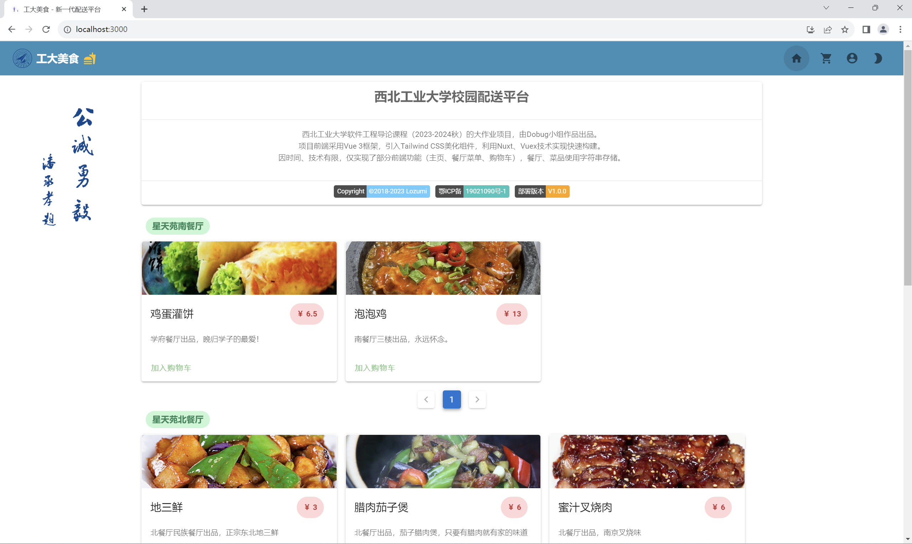
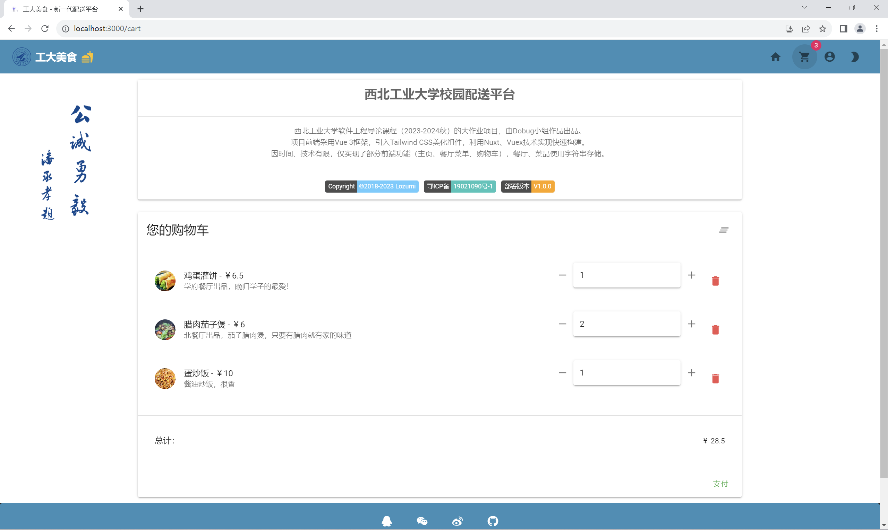
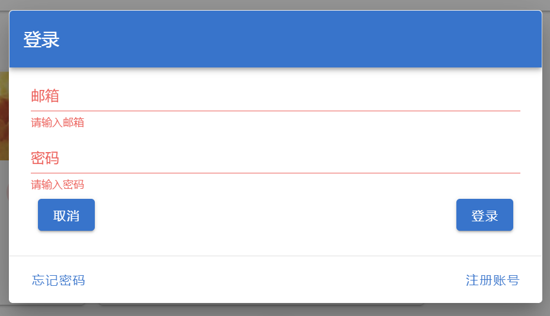
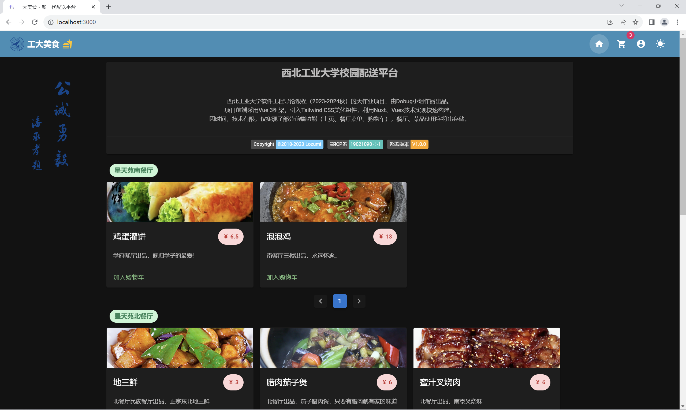

# 食在工大——食堂订餐配送系统

## 简介

“食在工大——食堂订餐配送系统”是基于Vue开发的Web应用系统，通过餐品展示、餐品订购、订单分配等模块实现即时、高效的订单配送功能。 

本系统旨在为校园订餐配送提供软件支持，以期解决学生日益增长的对美好饮食服务的需要与现系统不够实用不够完善的矛盾。

西北工业大学软件工程导论课程（2023-2024秋）的大作业项目，由Dobug小组作品出品。

项目前端采用Vue 3框架，引入Tailwind CSS美化组件，利用Nuxt、Vuex技术实现快速构建。

因时间、技术有限，仅实现了部分前端功能（主页、餐厅菜单、购物车），餐厅、菜品使用字符串存储。

## 技术栈

### 框架和运行环境

1. Vue: 版本3.3.9，渐进式JavaScript 框架。
2. Vuex: 版本4.1.0，Vue.js 应用程序的状态管理器。
3. Nuxt.js: 版本 2.13.0，基于 Vue.js 的通用应用框架。
4. Tailwind CSS: 版本3.3.5，实用程序优先的 CSS 框架。
5. Node.js: 版本16.20.2，JavaScript 跨平台执行环境。

### 依赖项

1. @mdi/font: 版本 5.3.45，Material Design 图标的字体。
2. @nuxtjs/auth: 版本 4.9.1，用于身份验证和授权的 Nuxt.js 模块。
3. @nuxtjs/axios: 版本 5.11.0，简化 HTTP 请求的 Nuxt.js 模块。
4. @nuxtjs/pwa: 版本 3.0.0-beta.20，用于支持渐进式 Web 应用 (PWA) 的 Nuxt.js 模块。

### 开发依赖项

1. @nuxtjs/color-mode: 版本 1.0.0，用于处理颜色模式的 Nuxt.js 模块。
2. @nuxtjs/tailwindcss: 版本 2.0.0，用于在 Nuxt.js 项目中集成 Tailwind CSS 的 Nuxt.js 模块。
3. @nuxtjs/vuetify: 版本 1.11.2，用于在 Nuxt.js 项目中集成 Vuetify 的 Nuxt.js 模块。

## 主要特性

1. 首页：简要介绍项目信息，声明项目属性、作者、备案号等。

   

2. 菜品展示：实现多餐厅展示，各餐厅菜品分页展示。展示菜品名称、图片、简介，菜品可快速加入购物车。

3. 购物车：实现订购展示，可修改订购数量。自动计算总额。

   

4. 登陆：实现登陆窗口，输入信息不全进行提示。后端传输和验证未实现。

   

5. 夜间模式：可一键切换夜间模式。

   

## 项目结构

```bash
|-- NPUFood-Nuxt
    |-- .dockerignore
    |-- .editorconfig
    |-- .gitignore
    |-- Dockerfile Docker配置文件
    |-- LICENSE 项目开源协议
    |-- nuxt.config.js
    |-- package-lock.json
    |-- package.json 项目包文件
    |-- README.md 项目介绍
    |-- tailwind.config.js
    |-- assets 资源
    |   |-- README.md
    |   |-- variables.scss
    |   |-- css
    |       |-- tailwind.css
    |-- components 组件
    |   |-- LoginDialog.vue 登陆组件
    |   |-- Restaurant.vue 餐厅组件
    |-- config 配置
    |   |-- restaurants.js 餐厅、菜品信息
    |-- docs 文档
    |   |-- pic1.png
    |   |-- pic2.png
    |   |-- pic3.png
    |   |-- pic4.png
    |-- layouts 外观
    |   |-- default.vue 默认页面
    |   |-- error.vue 错误页面
    |   |-- README.md
    |-- pages 页面
    |   |-- cart.vue 购物车
    |   |-- index.vue 餐厅及菜品
    |   |-- README.md
    |-- store 存储
        |-- cart.js
        |-- index.js
        |-- README.md
```

## 部署方法

1. docker部署
   - 建立docker镜像
     ```bash docker build -t npu-food .  ```

   - 建立docker容器
     ```bash docker run -it -p 5000:5000 npu-food```

   - 访问 ``` localhost:5000```

2. npm部署

```bash
# 安装依赖项
$ npm install

# 在 localhost:3000 进行热重载服务
$ npm run dev

# 构建并启动
$ npm run build
$ npm run start

# 生成静态工程
$ npm run generate
```
